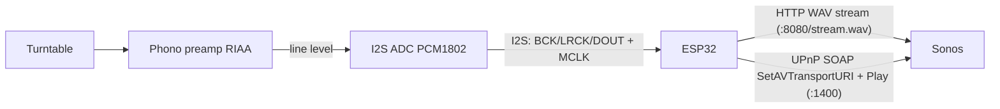

# ESP32 Sonos Streamer

> **WORK IN PROGRESS** - spikes validated, waiting for the ADC to stream from a turntable.

HiFi, lossless audio streamer to **Sonos** speakers over the local network, sourced from a
**turntable**, using an **ESP32** plus an **I2S ADC** - no Raspberry Pi, no server, no encoding.

The goal: give an "analog input" to Sonos speakers that lack one (e.g. Sonos One, SYMFONISK,
Arc, ...), so a record player can play throughout the house.

---

## Key idea: no encoding

Sonos speakers play a **raw WAV/PCM stream over HTTP** (UPnP/DLNA). So the ESP32 does **not**
need to compress anything:

- read PCM from the ADC over I2S,
- wrap it into an "infinite" WAV stream served over HTTP,
- tell Sonos to play it over UPnP (`SetAVTransportURI` + `Play`).

Result: **bit-perfect lossless**, CPU almost idle, no FLAC/MP3. The few seconds of latency are
irrelevant for vinyl.

---

## Architecture



Final data path: **local source (ADC) -> HTTP out -> Sonos**. Outbound traffic only.

---

## Project status

| Stage | Status |
|-------|--------|
| **Spike #1** - Sonos plays an infinite WAV stream over HTTP+UPnP | Validated |
| "Speaker on" chime when the stream is picked up | Done |
| Robust SOAP `SetAVTransportURI` + `Play` with retry | Done |
| Stability test (pink noise + real track via proxy) | Done |
| **Spike #2** - real I2S capture from the PCM1802 + ring buffer | Pending ADC |
| Phono preamp + turntable integration | Pending |
| Rotary encoder for volume (UPnP `SetVolume`) | Planned |
| Zone selector - choose which speaker set to stream to | Planned |

### Stability test results (ESP32-D0WD-V3 classic, 16-bit/44.1k stereo)

Realtime target = **176.4 kB/s**.

- **Pink noise** (local source, matches the final data path): sustained throughput
  **264-375 kB/s, roughly 2x headroom**. No issues.
- **Proxy** of a real track (PCM WAV pulled from a host and forwarded to Sonos): average
  ~190 kB/s, full track (3:14) played back with no glitches. Note: the proxy uses WiFi
  inbound **and** outbound, so it is a **harsher** test than the final design (outbound only).
- Observed WiFi jitter: up to ~80-120 ms on a single 10 ms block, so Spike #2 will use a
  **ring buffer of ~150-200 ms (~35 KB)** to absorb it.

---

## Hardware

| Component | Choice | Notes |
|-----------|--------|-------|
| MCU | **ESP32** (tested: ESP32-D0WD-V3 classic) | I2S RX + MCLK. S3 + PSRAM optional for a larger buffer |
| ADC | **PCM1802** (or PCM1808) 24-bit/96k I2S | Must be an **ADC (A/D)**, not a DAC (PCM5102 is wrong). Needs **line level** |
| Phono preamp | Schiit Mani 2 / ART DJPRE II, or a turntable with a built-in preamp | RIAA curve. Do not wire the cartridge directly to the ADC |
| Power | Dedicated low-noise LDO for the analog side | Supply noise degrades audio quality |

---

## Software

Framework: **ESP-IDF v5.3.2**. Main project: [`spike_idf/`](spike_idf/).
(`spike_sine/` is an earlier Arduino version, kept for reference.)

### Build and flash

```bash
# once: install ESP-IDF (esp32 target)
git clone -b v5.3.2 --recursive https://github.com/espressif/esp-idf.git ~/esp/esp-idf
~/esp/esp-idf/install.sh esp32

# configure
cd spike_idf
cp main/config.h.example main/config.h
# edit main/config.h: WiFi + Sonos IP

# build and flash
source ~/esp/esp-idf/export.sh
idf.py -p /dev/cu.usbserial-0001 flash monitor
```

After reset the ESP32 connects to WiFi, starts the stream server, tells Sonos to play, and you
hear the **chime** followed by the test content.

### Test modes (`STREAM_MODE` in `config.h`)

- `MODE_PINK` (default): 20 s of locally generated pink noise with throughput logging, then
  keep-alive silence. This is the stability test that matches the final data path.
- `MODE_PROXY`: pull a PCM WAV from an HTTP host and forward it to Sonos (to listen to real
  music). Start a server on your PC, for example:
  ```bash
  ffmpeg -i track.mp3 -ar 44100 -ac 2 -c:a pcm_s16le test_hifi.wav
  python3 -m http.server 8000   # in the folder that holds the wav
  ```
  and set `PROXY_HOST` / `PROXY_PORT` / `PROXY_PATH` in `config.h`.

---

## How it hooks into Sonos (UPnP notes)

- Discovery: SSDP `M-SEARCH` on `239.255.255.250:1900`, ST
  `urn:schemas-upnp-org:device:ZonePlayer:1`.
- Control: SOAP on `http://<sonos>:1400/MediaRenderer/AVTransport/Control`, actions
  `SetAVTransportURI` (with DIDL-Lite, `protocolInfo` `http-get:*:audio/wav:*`) and `Play`.
- In a group / stereo pair / home theater, always control the zone **coordinator**.

---

## Roadmap

1. **Spike #2**: I2S RX from the PCM1802 -> ring buffer -> stream (replaces the test generator).
2. Phono preamp + tests with the real turntable.
3. Rotary encoder for volume -> UPnP `RenderingControl SetVolume` (volume does **not** go
   through the audio stream).
4. Zone selector: choose which speaker set / coordinator to stream to.
5. Robustness: WiFi/Sonos reconnection, auto-start, multi-zone handling.

## License

TBD.
