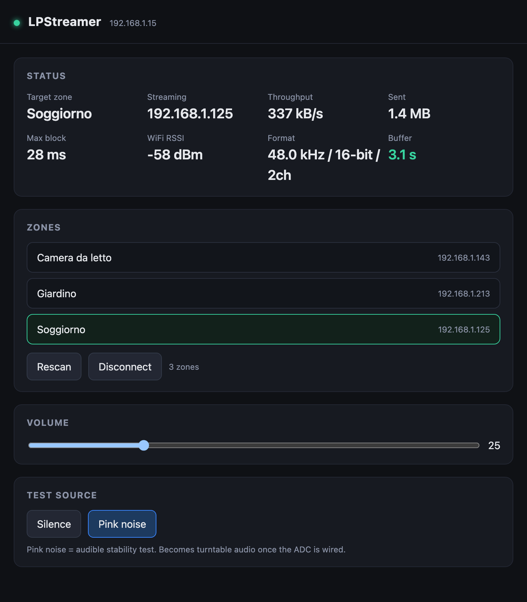

# LPStreamer firmware

Main firmware for the ESP32 Sonos streamer. Structured as ESP-IDF components:
a validated streaming engine plus a control plane (zone discovery/selection, web UI,
live stats) on top.

## Components

```
firmware/
  main/                 app_main.c   wiring + config.h
  components/
    net_wifi/           WiFi station: connect + IP + RSSI
    sonos/              SSDP discovery, ZoneGroupState topology parse, UPnP control
    audio_engine/       HTTP WAV stream server, test source, throughput stats
    webui/              dashboard (embedded HTML) + JSON API
```

Dependencies (ESP-IDF `REQUIRES`): `webui -> sonos, audio_engine, net_wifi`;
`main -> all`. Each component keeps its public API in `include/`.

## How it works

1. `net_wifi_start()` joins the LAN and blocks until an IP is assigned.
2. `audio_engine_start(8080)` opens a raw-TCP HTTP server that serves an infinite
   `audio/wav` PCM stream at `/stream.wav`. On each client (Sonos) connection it sends
   a WAV header, a short "speaker on" chime, then the selected source:
   - `AUDIO_SRC_SILENCE` (default): silent keep-alive.
   - `AUDIO_SRC_PINK`: pink noise, an audible stability test.
   It records live stats (throughput, bytes, worst 10 ms send latency).
   This is where the turntable ADC (I2S) will feed real PCM in a later stage.
3. `sonos_discover()` sends an SSDP `M-SEARCH`, then asks one responder for
   `GetZoneGroupState` and parses the topology into a list of zone coordinators
   (name + IP). Grouped speakers / stereo pairs / home theaters collapse to their
   coordinator, which is the correct target to stream to.
4. `webui_start(80)` serves the dashboard and JSON API. Selecting a zone points that
   coordinator at `http://<esp-ip>:8080/stream.wav` via UPnP `SetAVTransportURI` + `Play`.
5. The last selected zone is persisted in NVS; on boot the firmware auto-reconnects to it
   (`sonos_autoconnect`), so powering the system up needs no web interaction.

The stream is **48 kHz / 16-bit / stereo** (192 kB/s), matching the Sonos internal rate so
no resample happens. Hi-res (96 kHz / 24-bit) is pointless here: Sonos downsamples everything
to 48/16 internally.

Multiple zones at once: group the rooms in the Sonos app - a group appears as a single
coordinator here, and streaming to it plays all rooms in sync. Grouping from this UI (UPnP
`x-rincon:` join) is a planned feature.

## Web UI / JSON API

Open `http://<esp-ip>/` for the dashboard (status, zone picker, volume, source toggle).

<p align="center">
  
</p>

| Method | Endpoint | Description |
|--------|----------|-------------|
| GET  | `/`            | dashboard (HTML) |
| GET  | `/api/status`  | JSON: ip, zone, streaming, client, kbps, sent, batch_us, buffer_s, rssi, source, rate, bits, ch |
| GET  | `/api/zones`   | JSON: `{active, zones:[{name, ip}]}` |
| POST | `/api/select?i=N` | stream to zone index N (stops the previous, plays the new); persisted as last zone |
| POST | `/api/volume?v=N` | set volume 0..100 on the active coordinator (UPnP `SetVolume`) |
| POST | `/api/source?s=pink\|silence` | switch the test source |
| POST | `/api/disconnect` | stop the active coordinator and release it (e.g. to use the TV) |
| POST | `/api/rescan`  | re-run Sonos discovery |

`/api/status` example:

```json
{"ip":"192.168.1.15","zone":"Soggiorno","streaming":true,"client":"192.168.1.125",
 "kbps":337.0,"sent":1400000,"batch_us":28000,"buffer_s":3.1,"rssi":-58,
 "source":"pink","rate":48000,"bits":16,"ch":2}
```

- `buffer_s`: seconds of audio buffered ahead of realtime (audio sent minus wall-clock
  elapsed) - an estimate of the Sonos + in-flight buffer depth.
- To reconnect after `disconnect`, just select a zone again.

## UPnP details

- Discovery: SSDP `M-SEARCH` on `239.255.255.250:1900`, ST
  `urn:schemas-upnp-org:device:ZonePlayer:1`.
- Topology: SOAP `GetZoneGroupState` on `ZoneGroupTopology`; the returned XML is
  entity-unescaped and scanned for `<ZoneGroup Coordinator=...>` and the
  `<ZoneGroupMember UUID=... Location=... ZoneName=...>` whose UUID equals the coordinator.
- Control: SOAP on `http://<ip>:1400/MediaRenderer/AVTransport/Control`
  (`SetAVTransportURI`, `Play`, `Stop`) and `.../RenderingControl/Control` (`SetVolume`).
  DIDL-Lite metadata declares `protocolInfo` `http-get:*:audio/wav:*`.
- All SOAP calls retry (cold ARP/TCP toward a Sonos sometimes returns
  `ESP_ERR_HTTP_EAGAIN` on the first try).

## Build and flash

```bash
source ~/esp/esp-idf/export.sh
cp main/config.h.example main/config.h    # then edit WiFi credentials
idf.py -p /dev/cu.usbserial-0001 flash monitor
```

`config.h` is gitignored (keeps WiFi credentials out of the repo).

## Notes / limits (WIP)

- Audio source is still the test generator; the I2S ADC path is a later stage.
- One stream client at a time (a single Sonos coordinator). Grouping several rooms in
  the Sonos app and streaming to that group's coordinator plays them together.
- Planned: group zones from this UI (UPnP `x-rincon:` join); SSD1306 OLED status display
  and a KY-040 rotary encoder that mirror the web UI (zone select + volume).
